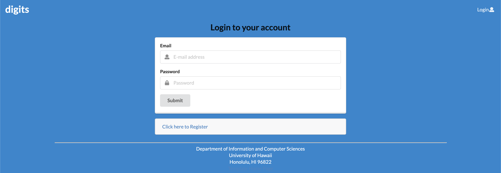

Starting at the landing page, here we are prompted with the website details

This overview shows the sites features:
Multiple Users, Contact Details, and Timestamped Notes

In the top right hand corner of the landing page, we can log in to access the database.

Once logged in as a user:
We now have access to pages Add Contact and List Contacts.
If there are no active contacts, List Contacts will not show any contacts, however contacts can be added
by filling in the add contact form with appropriate data.

Once contacts are added, we can edit the current contact to change the first or lastname, description, address, and
image, along with adding notes to a contact by entering a note under the prompt "add a timestamped note"
Here these notes do as it says adding a note and specifying the date in which the note was added.

Once logged in as a admin:
We can also have access to Add Contact and List Contacts which have the same operations as a user account.

However we now have access to the admin tab, which shows all current contacts in the database, whether uploaded from 
a user or admin account

To exit, or log out simply click the email/account user name in the top right hand corner of the screen 
Select Sign Out and you will no longer be granted access to contacts